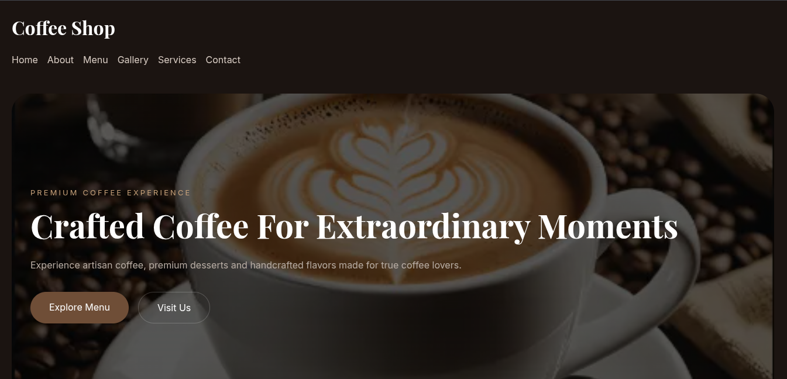

# Coffee Shop ☕

A modern, responsive coffee shop landing page built with HTML, CSS and JavaScript.

This project was developed as a front-end portfolio template, focusing on clean code, responsive design, accessibility, SEO and performance.

---

## 📷 Preview

Below is a preview of the homepage.



---

## Pages

- Home
- About
- Menu
- Gallery
- Services
- Contact

---

## 🌐 Live Demo 

[View Live Demo] (https://leonardo876544.github.io/coffee-shop-template/)

---
## What's Included

- 6 responsive HTML pages
- CSS stylesheets
- JavaScript functionality
- Gallery filtering
- Responsive navigation
- Local image assets
- Preview images
- Documentation
- MIT License
- 
---
## Requirements

No framwworks or build tools are required.

The template can be edited using any code editor and opened directly in a modern web browser.

---

## ✨ Features

- Responsive design
- Mobile First approach
- Modern UI
- Navigation bar
- Hero section
- About section
- Menu page
- Gallery with category filters
- Contact page
- Google Maps integration
- Social media links
- Optimized images (WebP)
- Semantic HTML
- Accessibility improvements
- SEO optimized

---

## 🛠 Technologies

- HTML5
- CSS3
- JavaScript
- Google Fonts
- Font Awesome

---
# ⚠️ Important 

This template does not include a backend, database, authentication system, payment processing, or functional online ordering system.

The images used in the demo are for demonstration purposes and may need to be replaced with the buyer's own images and licensed assets.

---

## 📁 Project Structure

```
project/
│
├── assets/
│   ├── css/
│   ├── images/
│   ├── js/
│   └── icons/
│
├── index.html
├── about.html
├── menu.html
├── gallery.html
├── services.html
├── contact.html
│
├── README.md
├── LICENSE
├── CHANGELOG.md
└── DOCUMENTATION.md
```

---

## 📱 Responsive

This template was tested for multiple screen sizes, including:

- 320px
- 375px
- 390px
- 425px
- 768px
- Desktop

---

## ♿ Accessibility

Accessibility was considered during development.

Examples:

- Semantic HTML
- Image alt attributes
- ARIA labels
- Responsive layout
- Keyboard-friendly navigation

---

## 🚀 Performance

During development the project was optimized using:

- WebP images
- Lazy Loading
- Optimized CSS
- Lighthouse improvements

Latest Lighthouse scores:

- Performance: 92
- Accessibility: 98
- Best Practices: 100
- SEO: 100

---

## 📄 License

This project is licensed under the MIT License.

---

## 👨‍💻 Author

Leonardo Farias Nascimento

Full-Stack Developer

GitHub:
https://github.com/Leonardo876544

